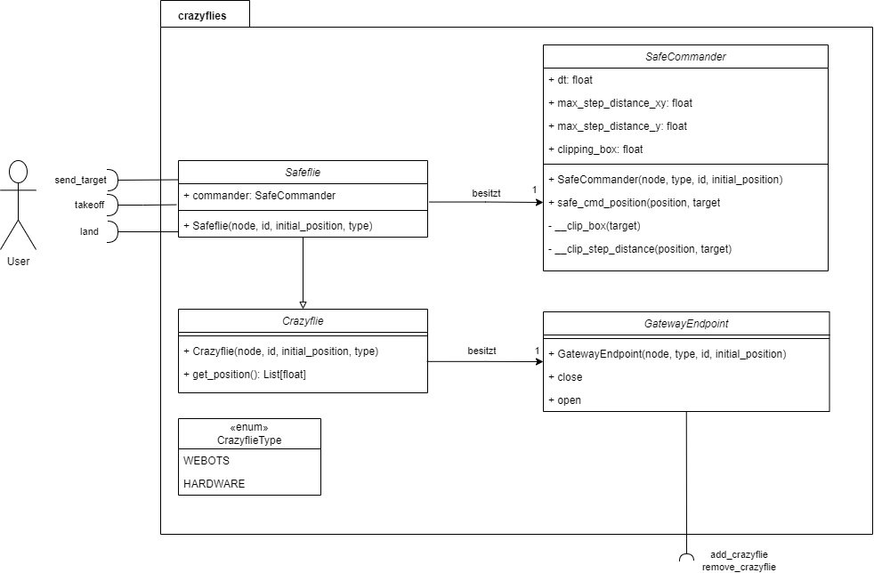

.. _crazyflies:

.. toctree::

Crazyflie and Safeflie
======================================

The ``Crazyflie`` and ``Safeflie`` classes are examples of how to use the underlying interface to control a Crazyflie, they use the :doc:`crazyflie interfaces package </crazyflie_interfaces_python>` to do so. It is the easiest way to start implementing your own logic. A Crazyflie/Safeflie will automatically call the gateway to establish a Crazyflie connection.

If reduced functionality is required, it is recommended to use the Client classes to implement only parts of the communication on the application layer. This is especially important when using many Crazyflies to limit the number of ROS Topic connections.

The following class diagram shows the Crazyflie and Safeflie classes and how the user can interact with them.

.. note:: Not shown in the diagram are the connections of the Crazyflie with the underlying software stack.

Safeflie
----------

The Safeflie allows to safely switch between the high level commander and the low level commander.
It provides 3 topics: 

* ``safeflieID/takeoff``
* ``safeflieID/land``
* ``safeflieID/sendTarget``

With takeoff and land the crazyflie can be started and stopped. 
During flight, targets can be sent using the `sendTarget <https://github.com/DynamicSwarms/ds-crazyflies/blob/master/src/crazyflies_interfaces/msg/SendTarget.msg>`_ topic:

.. code-block:: 
    :caption: SendTarget.msg

    uint8 priority # priority of the target, lower priority is more important
    geometry_msgs/Vector3 target # Target position
    string base_frame # Base frame the target is relative to
    string info # Additional information

.. note:: Only the target field is currently used. It describes the desired target in world coordinates.

.. image:: assets/SafeflieStateMachine.drawio.png
  :align: center
  :width: 1000
  :alt: State machine of safeflie

``Crazyflie`` class
-------------------

.. autoclass:: crazyflies.crazyflie.Crazyflie
    :show-inheritance:
    :members:

``Safeflie`` class
------------------

.. autoclass:: crazyflies.safeflie.Safeflie
    :show-inheritance:
    :members:
