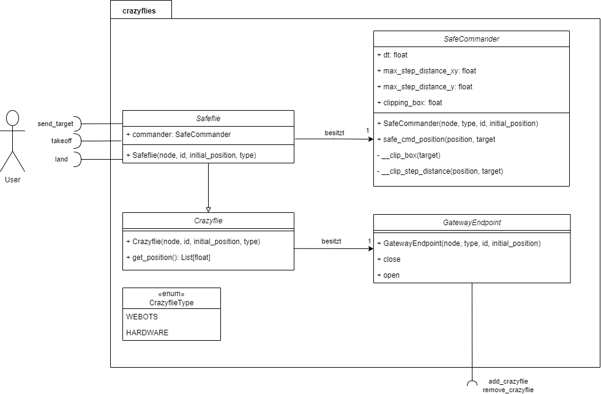

.. _crazyflies:

crazyflies-Package
==================

.. toctree::

Crazyflie and Safeflie Classes
******************************

If you want to start scripting your own application logic, you can use the `crazyflies` package to create a Crazyflie or Safeflie.

The ``Crazyflie`` and ``Safeflie`` classes are examples of how to use the underlying interface to control a Crazyflie, they use the :doc:`crazyflie interfaces package </crazyflie_interfaces_python>` to do so. It is the easiest way to start implementing your own logic. A Crazyflie/Safeflie will automatically call the gateway to establish a Crazyflie connection.

If reduced functionality is required, it is recommended to use the Client classes to implement only parts of the communication on the application layer. This is especially important when using many Crazyflies to limit the number of ROS Topic connections.

The following class diagram shows the Crazyflie and Safeflie classes and how the user can interact with them.

.. note::
  The `ds-crazyflies` repository tries to provide a universal framework for crazyflies. For a more detailed but therefore also more use-case specific example on how to use `ds-crazyflies` also check out  the `Pad Swarming <https://github.com/DynamicSwarms/pad_swarming>`_ repository. The repository allows to fly up to 50 Crazyflies equipped with QI-Charges.

Safeflie
----------

.. note:: Not shown in the diagram are the connections of the Crazyflie with the underlying software stack.

``Crazyflie`` class
-------------------

.. autoclass:: crazyflies.crazyflie.Crazyflie
    :show-inheritance:
    :members:

``Safeflie`` class
------------------

.. autoclass:: crazyflies.safeflie.Safeflie
    :show-inheritance:
    :members: