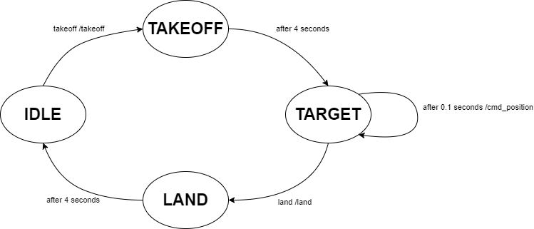

.. _safeflie:

Safeflie
########

You have now learned how to control a connected crazyflie using the high level commander.

A big problem of the high level commander inside the crazyflie is the limited supported update rate when sending go_to commands. 
These should ideally not be sent out with more than 1Hz. 
The Safeflie tries to mitigate this by using the high level commander only for takeoff and landing, while during flight the low level command `cmd_position` is used. This however has to be sent continously while flying and the transitions between the two command modes have to be handled carefully.

The Safeflie allows to safely switch between the high level commander and the low level commander.
It provides 5 topics: 

* ``safeflieID/takeoff``
* ``safeflieID/land``
* ``safeflieID/sendTarget``
* ``safeflieID/takeoff_to``
* ``safeflieID/land_to``

With takeoff and land the crazyflie can be started and stopped (they are of the type `std_msgs/msg/Empty`). 
During flight, targets can be sent using the `sendTarget <https://github.com/DynamicSwarms/ds-crazyflies/blob/master/src/crazyflies_interfaces/msg/SendTarget.msg>`_ topic:

.. code-block:: 
    :caption: SendTarget.msg

    geometry_msgs/Point target # Target position

With the `takeoff_to` and `land_to` topics, takeoff and landing to a specific height can be commanded (they are of the type `std_msgs/msg/Float32`).

Start your first Safeflie
-------------------------

A safeflie is a node which uses the framework, and provides a simplified interface for controlling a crazyflie.
Make sure the `framework.launch.py` is running with the appropriate settings.
(If using webots make sure your Webots instance is running with the crazyflie you want to connect to.)

.. note::
    The safeflie automatically `adds` the crazyflie to the appropriate gateway (hardware or webots) when instantiated.
    Do not add the crazyflie with rqt or service call before instantiating the safeflie.

Then in a new terminal you can start a Safeflie with:

.. code-block:: bash

    ros2 launch crazyflies safeflie.launch.py id:=0 type:=2 channel:=80 initial_position:=[0.0,0.0,0.0] tracked:=false

* **id**: The id of the crazyflie.
* **type**: 1 if you want to connect a hardware crazyflie. 2 if you want to connect a webots crazyflie.
* **channel**: The channel of the crazyflie, if a real crazyflie is used.
* **initial_position**: The crazyflies initial position, if a real crazyflie is used.
* **tracked**: Whether the crazyflie is tracked by an external tracking system. (Leave as is if using Webots or Lighthouse/Loco) (default: False).

For webots crazyflies only the id is necessary.

When the safeflie is running, you can use the topics mentioned above to control the crazyflie.
E.g. to takeoff:

.. code-block:: bash

    ros2 topic pub /safeflie0/takeoff std_msgs/msg/Empty "{}" --once

Dont want to use a safeflie? Then implement your own controller by following the  :doc:`API Documentation </api>`.